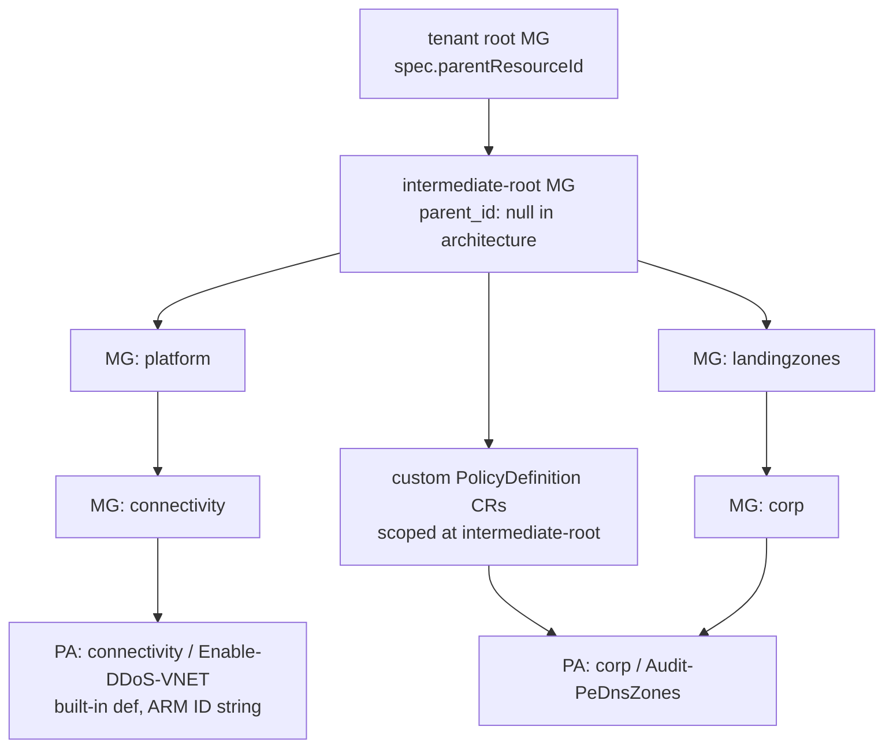

# Azure Landing Zones — kro prototype

A working, scoped implementation of [Azure Landing Zones](https://github.com/Azure/Azure-Landing-Zones-Library) on top of [kro.run](https://kro.run).

The prototype is **library-driven and architecture-driven**, mirroring the authoring model of the Terraform [`avm-ptn-alz`](https://github.com/Azure/terraform-azurerm-avm-ptn-alz) module: you pick a base architecture from one or more libraries, and the renderer materialises the full kro `ResourceGraphDefinition` for you. Overrides are opt-in.

**In scope**

- Management group hierarchy (`Microsoft.Management/managementGroups`)
- Custom Azure policy definitions (`Microsoft.Authorization/policyDefinitions`) — only the ones actually referenced by an emitted assignment
- Azure policy assignments scoped to management groups (`Microsoft.Authorization/policyAssignments`)
- Layered libraries (your org's library on top of the Azure upstream)
- Custom archetypes, custom MGs, per-(MG → assignment) parameter and enforcement tweaks

**Out of scope** (deliberate — see [`../../docs/research/azure-landing-zones-kro-prototype.md`](../../docs/research/azure-landing-zones-kro-prototype.md))

- **Policy set definitions (initiatives)**. Many archetype assignments target custom initiatives like `Enforce-Guardrails-Storage` and `Enforce-ALZ-Sandbox`; the renderer warns and passes the placeholder ARM ID through. Adding initiatives is a follow-up.
- Role definitions, identity / networking / management workloads.

## Layout

```
azure-landing-zones-kro/
├── README.md                       ← this file
├── mapping.md                      ← how upstream ALZ Library maps into the rendered graph
├── landingzone.yaml                ← AUTHORING FILE — the only thing humans edit
├── generated/
│   └── resourcegraph.yaml          ← rendered kro ResourceGraphDefinition (committed)
└── values/
    └── dev.yaml                    ← example AzureLandingZone instance input
```

The renderer lives at `../../tools/render`.

## Authoring model

`landingzone.yaml` is intentionally small. Required keys:

- `parentResourceId` — tenant root MG id (set on the deployed `AzureLandingZone` instance).
- `prefix` — string prepended to every emitted MG name. Lets multiple ALZ instances coexist.
- `location` — default region for assignments that need one.
- `libraries` — ordered list of `{repo, ref, path}` entries pointing at directories that follow the standard ALZ library layout. **Later libraries override earlier ones on the same file basename** — this is the inheritance mechanism. Keep `Azure/Azure-Landing-Zones-Library` as the base; layer your org's library on top to override the `alz` architecture, add archetypes, override assignment defaults, etc.

Optional overlays:

| Key | Purpose |
|-----|---------|
| `baseArchitecture: alz` | Pick an architecture from the merged library set. Omit to start from scratch. |
| `managementGroups` | Add new MGs, override existing MGs (parent / displayName / archetypes), or remove with `disabled: true`. |
| `archetypes` | Define brand-new archetypes by composing assignment names from the merged library set. |
| `archetypeOverrides` | `add`/`remove` assignments on a library archetype without redefining it. |
| `policyAssignmentsToModify` | Per-(MG-name → assignment-name) tweaks: parameters, `enforcementMode`, `identity`, `location`. |
| `policyAssignmentsToDisable` | Skip an inherited assignment for one MG without changing the archetype. |
| `policyDefaultValues` | Shared values consumed via `alz_policy_default_values.json` — one value flows into many assignment parameters (e.g. `ddos_protection_plan_id` populates `Enable-DDoS-VNET.ddosPlan`). |

A minimal valid input is just the four required keys plus `baseArchitecture: alz`. That matches Terraform's smallest avm-ptn-alz example.

## Rendering

```bash
go -C tools/render run . \
  -in prototypes/azure-landing-zones-kro/landingzone.yaml \
  -out prototypes/azure-landing-zones-kro/generated/resourcegraph.yaml
```

What the renderer does:

1. Fetches each library's tree at its pinned `ref` from `raw.githubusercontent.com`. Builds per-library catalogues for `architecture_definitions/`, `archetype_definitions/`, `policy_assignments/`, `policy_definitions/`, and `alz_policy_default_values.json`.
2. Merges the catalogues file-name-wise (later libraries win). `alz_policy_default_values.json` is merged at the `default_name` level so an org library can replace individual defaults.
3. Resolves the base architecture (if set), then applies `managementGroups` overlays — adds new MGs, overrides existing ones, drops MGs marked `disabled: true`.
4. For each MG, unions the assignment lists from every archetype it carries (library archetypes overlaid with `archetypes` and `archetypeOverrides`), then drops anything listed in `policyAssignmentsToDisable`.
5. For each (mg, assignment) pair: starts from the merged library assignment JSON, substitutes `policyDefaultValues` into named parameters per `alz_policy_default_values.json`, and applies `policyAssignmentsToModify` overrides.
6. Emits one `ManagementGroup` CR per MG, one `ManagementGroupPolicyAssignment` CR per emitted (mg, assignment) pair, and **only the custom `PolicyDefinition` CRs actually referenced** by an emitted assignment (typical reduction: 149 → ~5 with the default ALZ architecture).
7. Validates every name reference (assignment, archetype, MG parent) before emitting; fails fast on typos.

## Chaining (the DAG kro builds from CEL refs)



Every edge above is **not** a `dependsOn` — it is a CEL ref the renderer emits. kro infers reconciliation order from these refs:

- Parent MG reconciles before child MG.
- Custom `PolicyDefinition` reconciles before any assignment that targets it.
- Target MG reconciles before the assignment scoped to it.

## Prerequisites (when applying for real)

1. A Kubernetes cluster with credentials for an Azure tenant where you have **Management Group Contributor** at the tenant root.
2. [`kro`](https://kro.run/docs/getting-started/installation/) installed.
3. The Upbound Crossplane Azure providers installed and configured with Azure credentials:
   - `xpkg.upbound.io/upbound/provider-azure-management` (supplies `ManagementGroup`)
   - `xpkg.upbound.io/upbound/provider-azure-authorization` (supplies `PolicyDefinition`, `ManagementGroupPolicyAssignment`)
4. Go 1.22+ (only needed to re-render after editing `landingzone.yaml` or bumping a library `ref`).

## Apply workflow

```bash
# 1. (only if you edited landingzone.yaml or bumped a library ref)
go -C tools/render run . \
  -in prototypes/azure-landing-zones-kro/landingzone.yaml \
  -out prototypes/azure-landing-zones-kro/generated/resourcegraph.yaml

# 2. install the ResourceGraphDefinition (registers the AzureLandingZone CRD)
kubectl apply -f prototypes/azure-landing-zones-kro/generated/resourcegraph.yaml

# 3. apply one or more AzureLandingZone instances
kubectl apply -f prototypes/azure-landing-zones-kro/values/dev.yaml

# 4. observe
kubectl get azurelandingzones
kubectl get managementgroups.management.azure.upbound.io
kubectl get policydefinitions.authorization.azure.upbound.io
kubectl get managementgrouppolicyassignments.authorization.azure.upbound.io
```

Apply order between (2) and (3) is irrelevant for correctness — kro and the provider controllers reconcile continuously and respect the inferred DAG.

## Design notes

- The graph models **desired state**. Drift in any MG attribute, assignment parameter, or custom definition body is reverted by the underlying controllers on their next loop.
- MG hierarchy ordering, assignment→MG scoping, and assignment→definition references are **not encoded as `dependsOn` steps**. They are CEL references the renderer emits; kro builds the DAG from those references.
- Per-environment differences (tenant id, DDoS plan ID, log analytics workspace, default location) are inputs on the `AzureLandingZone` schema or on `policyDefaultValues` — see `values/dev.yaml`. The graph itself does not change between environments.
- Updating from upstream = bump the `ref` of one of your `libraries` entries, re-render, review the diff, commit. There is no per-policy code to update.
- Anonymous GitHub API limits apply during rendering (60 requests/hour). For frequent re-renders, run with a `GITHUB_TOKEN` set in the environment — this is a follow-up improvement the renderer does not currently consume; for now spread re-renders or use a personal access token via reverse proxy.
- See [`../../docs/research/azure-landing-zones-kro-prototype.md`](../../docs/research/azure-landing-zones-kro-prototype.md) for the trait-by-trait alignment with `docs/traits-spec.md`, the rationale for the renderer-vs-runtime-iteration choice, and the Terraform parity discussion.
