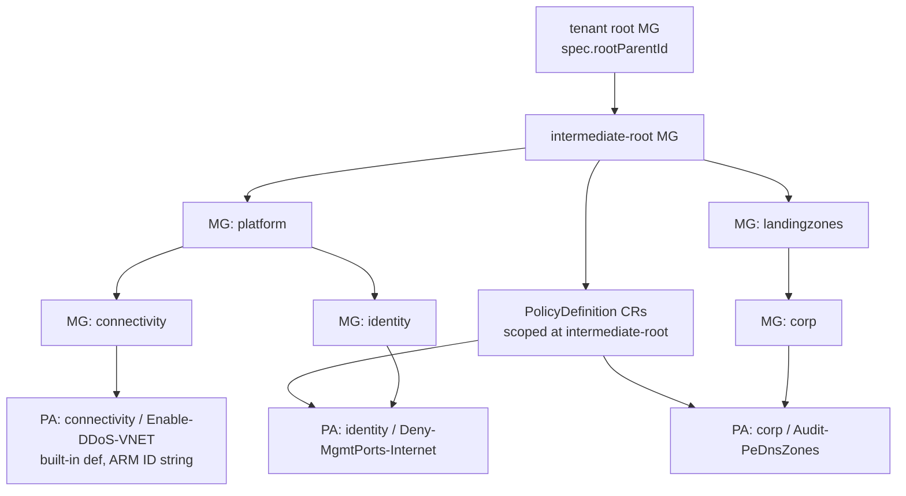

# Azure Landing Zones — kro prototype

A working, scoped implementation of [Azure Landing Zones](https://github.com/Azure/Azure-Landing-Zones-Library) on top of [kro.run](https://kro.run).

The prototype is **library-driven**: a small Go renderer reads a declarative
`landingzone.yaml` plus the upstream Azure-Landing-Zones-Library at a pinned
commit SHA and emits the full kro `ResourceGraphDefinition`. No hand-rolled
resource templates per policy or per assignment.

**In scope**

- Management group hierarchy (`Microsoft.Management/managementGroups`)
- Custom Azure policy definitions (`Microsoft.Authorization/policyDefinitions`) — every custom def the library ships is emitted
- Azure policy assignments scoped to management groups (`Microsoft.Authorization/policyAssignments`)

**Out of scope** (deliberate — see [`../../docs/research/azure-landing-zones-kro-prototype.md`](../../docs/research/azure-landing-zones-kro-prototype.md))

- Policy set definitions (initiatives), role definitions, identity / networking / management workloads.

## Layout

```
azure-landing-zones-kro/
├── README.md                       ← this file
├── mapping.md                      ← how upstream ALZ Library maps into the rendered graph
├── landingzone.yaml                ← AUTHORING FILE — the only thing humans edit
├── generated/
│   └── resourcegraph.yaml          ← rendered kro ResourceGraphDefinition (committed)
└── values/
    └── dev.yaml                    ← example AzureLandingZone instance input
```

The renderer lives at `../../tools/render`.

## Authoring model

`landingzone.yaml` declares:

- `prefix`, `rootParentId`, `location` — top-level inputs surfaced on the generated CRD schema.
- `libraryRef` — pinned upstream commit SHA. Bumping this is how you update from upstream.
- `inputs:` — a free-form map of environment-specific values (DDoS plan id, log analytics workspace id, …) surfaced as `spec.inputs.<key>` on the `AzureLandingZone` CRD. Reference them from policy assignment parameters as `${inputs.<key>}`.
- `managementGroups:` — the hierarchy. Each entry has `name`, `parent` (another MG name, or the special token `root` for the intermediate-root MG that sits under the tenant root), optional `displayName`, and an optional `policyAssignments:` list. Each entry in `policyAssignments` is a `{name, parameters?}` pair where `name` matches a file in `platform/alz/policy_assignments/` upstream.

Adding a new policy assignment to an MG is one list entry. Adding a new MG is one block. There is no per-policy or per-definition code.

## Rendering

```bash
go -C tools/render run . \
  -in prototypes/azure-landing-zones-kro/landingzone.yaml \
  -out prototypes/azure-landing-zones-kro/generated/resourcegraph.yaml
```

What the renderer does:

1. Fetches the upstream library tree at `libraryRef` from `raw.githubusercontent.com` and loads every `policy_definitions/*.json` and `policy_assignments/*.json`.
2. Emits one `ManagementGroup` CR per MG in the input. Each child references its parent through a CEL ref `${...status.atProvider.id}`.
3. Emits one `PolicyDefinition` CR per **custom** definition the library ships (the policy rule, parameters, and metadata are passed through as JSON strings). Built-in definitions are skipped — assignments reference them by ARM ID.
4. For each `(mg, assignment)` pair: looks the assignment up in the library, merges default parameters with user overrides, and emits a `ManagementGroupPolicyAssignment` CR. If the upstream assignment targets a custom definition we just emitted, the `policyDefinitionId` is a CEL ref to that CR. Otherwise it stays a built-in ARM ID.

## Chaining (the DAG kro builds from CEL refs)



Every edge above is **not** a `dependsOn` — it is a CEL ref the renderer emits. kro infers reconciliation order from these refs:

- Parent MG reconciles before child MG.
- Custom PolicyDefinition reconciles before any assignment that targets it.
- Target MG reconciles before the assignment scoped to it.

## Prerequisites (when applying for real)

1. A Kubernetes cluster with credentials for an Azure tenant where you have **Management Group Contributor** at the tenant root.
2. [`kro`](https://kro.run/docs/getting-started/installation/) installed.
3. The Upbound Crossplane Azure providers installed and configured with Azure credentials:
   - `xpkg.upbound.io/upbound/provider-azure-management` (supplies `ManagementGroup`)
   - `xpkg.upbound.io/upbound/provider-azure-authorization` (supplies `PolicyDefinition`, `ManagementGroupPolicyAssignment`)
4. Go 1.22+ (only needed to re-render after editing `landingzone.yaml` or bumping `libraryRef`).

## Apply workflow

```bash
# 1. (only if you edited landingzone.yaml or bumped libraryRef)
go -C tools/render run . \
  -in prototypes/azure-landing-zones-kro/landingzone.yaml \
  -out prototypes/azure-landing-zones-kro/generated/resourcegraph.yaml

# 2. install the ResourceGraphDefinition (registers the AzureLandingZone CRD)
kubectl apply -f prototypes/azure-landing-zones-kro/generated/resourcegraph.yaml

# 3. apply one or more AzureLandingZone instances
kubectl apply -f prototypes/azure-landing-zones-kro/values/dev.yaml

# 4. observe
kubectl get azurelandingzones
kubectl get managementgroups.management.azure.upbound.io
kubectl get policydefinitions.authorization.azure.upbound.io
kubectl get managementgrouppolicyassignments.authorization.azure.upbound.io
```

Apply order between (2) and (3) is irrelevant for correctness — kro and the provider controllers reconcile continuously and respect the inferred DAG.

## Design notes

- The graph models **desired state**. Drift in any MG attribute (display name, parent), any policy assignment parameter, or any custom definition body is reverted by the underlying controllers on their next loop.
- MG hierarchy ordering, assignment→MG scoping, and assignment→definition references are **not encoded as `dependsOn` steps**. They are CEL references the renderer emits; kro builds the DAG from those references.
- Per-environment differences (root parent MG, DDoS plan ID, log analytics workspace, default location) are inputs on the `AzureLandingZone` schema — see `values/dev.yaml`. The graph itself does not change between environments.
- Updating from upstream = bump `libraryRef` in `landingzone.yaml`, re-run the renderer, review the diff, commit. There is no per-policy code to update.
- See [`../../docs/research/azure-landing-zones-kro-prototype.md`](../../docs/research/azure-landing-zones-kro-prototype.md) for the trait-by-trait alignment with `docs/traits-spec.md` and the rationale for the renderer-vs-runtime-iteration choice.
